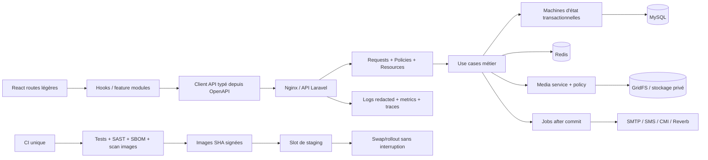

# AUDIT TECHNIQUE, FONCTIONNEL, SÉCURITÉ, ARCHITECTURE, QUALITÉ, CI/CD ET UI/UX — YAZOO

**Date de l'audit :** 14 août 2026  
**Périmètre :** dépôt local `C:\Users\seef7\OneDrive\Desktop\YaZoo`  
**Révision auditée :** `3464df84c3892e604968795a1e6093b8e52824d1` (`main`, synchronisée avec `origin/main` au début de l'audit)  
**Mode :** lecture et contrôles non destructifs ; aucun correctif, migration destructive, changement de production, commit, push ou appel cloud  
**Confiance :** élevée pour le code et les tests locaux ; limitée pour les services externes et l'état réel de production

---

## 0. Méthode, périmètre et limites

L'audit a indexé **27 225 entrées** présentes dans le workspace, dépendances, caches et historique Git inclus. Le périmètre de code source de première partie comprend **817 fichiers suivis par Git**, dont 449 sous `backend`, 269 sous `frontend`, 47 sous `docs`, 21 sous `scripts`, 6 sous `deploy`, 6 sous `infra` et 3 workflows GitHub. Les dépendances vendored ont été évaluées via leurs manifests, lockfiles et outils d'audit, et non relues ligne par ligne.

Contrôles réellement exécutés :

- inventaire Git complet, branches, statut, historique, fichiers ignorés et recherche de secrets courants dans le contenu suivi et l'historique ;
- lecture des routes, contrôleurs, modèles, requêtes, ressources, services, policies, migrations, seeders, middlewares, configuration, Docker, Nginx, scripts, workflows et documentation ;
- rapprochement statique des appels API frontend avec les routes backend : **69 appels statiques analysés, aucun chemin statique frontend sans route backend correspondante** ;
- `composer validate --strict` : succès ;
- `composer audit --no-interaction` : aucune vulnérabilité connue signalée au moment du contrôle ;
- analyse syntaxique de **413 fichiers PHP** : 0 erreur ;
- `php artisan test` : **368 tests réussis, 2 027 assertions** ;
- couverture backend : **85,53 % des instructions**, **70,58 % des méthodes** ;
- `vendor/bin/pint --test` : échec sur 2 fichiers, détaillé dans YAZ-016 ;
- Vitest : **128 tests réussis dans 37 fichiers** ; couverture déclarée : 76,84 % instructions, 58,13 % branches, 74,31 % fonctions, 76,71 % lignes, avec la réserve majeure YAZ-002 ;
- ESLint, typecheck TypeScript, audit i18n, audit Tailwind et build Vite : succès ;
- build frontend : 308 modules ; chunk d'entrée 348,86 kB (102 kB gzip), vendor React 230,63 kB (73,95 kB gzip), CSS 117,33 kB (18,16 kB gzip) ;
- Playwright + axe : **97 scénarios réussis** de 360 px à 1 920 px, FR/AR/EN, clair/sombre, RTL et routes publiques/protégées simulées ;
- `docker compose config`, gardes de release, gardes des scripts Azure et bootstrap showcase : succès.

Limites explicites :

- le navigateur intégré ne disposait d'aucune session ; l'audit visuel repose donc sur le code et Playwright/axe, sans validation humaine pixel par pixel, lecteur d'écran réel ni appareils physiques ;
- le daemon Docker était inaccessible dans le sandbox : tailles finales des images, utilisateur effectif à l'exécution et scan CVE d'image non mesurés ;
- le test MySQL réel de concurrence n'a pas été relancé ; la suite principale a utilisé SQLite en mémoire ;
- `npm audit` n'a pas été relancé hors sandbox faute d'autorisation réseau ; le pipeline le prévoit, mais l'état npm actuel reste **non vérifié** ;
- Azure, DockerHub, GitHub distant, Google OAuth, Twilio/SMS, SMTP, Reverb public, CMI et monitoring externe n'ont pas été contactés ;
- aucune conclusion juridique n'est formulée. La conformité est uniquement évaluée sous l'angle technique.

---

# A. Résumé exécutif

YaZoo est un projet **substantiel et déjà mature techniquement** : Laravel 12, PHP 8.2+, React 19, Vite 8, MySQL/SQLite, Redis, Reverb, MongoDB GridFS, Docker, Azure App Service et trois workflows GitHub. L'architecture contient des Form Requests, Resources, Policies, services métier, transactions et verrous pessimistes sur les flux financiers/réservations. L'authentification par cookie Sanctum chiffré et HttpOnly, le double-submit CSRF, les limites de débit, l'OTP haché avec verrouillage et le MFA administrateur sont de bons marqueurs de sécurité.

La qualité locale est supérieure à celle d'un prototype : 368 tests backend et 128 tests frontend passent, le build est propre, les migrations s'exécutent sous SQLite, les routes API sont cohérentes avec les appels frontend détectables, et 97 scénarios responsive/accessibilité automatisés passent. Aucun secret de forte confiance ni vulnérabilité critique confirmée n'a été trouvé dans le code suivi ou l'historique accessible.

Trois sujets empêchent néanmoins de qualifier le produit de totalement prêt :

1. une condition de concurrence confirmée par lecture dans la transition d'état des rendez-vous vétérinaires ;
2. une couverture frontend qui ne mesure qu'une liste blanche réduite, laissant 33 pages sur 47 sans test direct identifié ;
3. la portée multilingue réelle limitée à FR/AR/EN alors que ES/NL/PT/IT sont demandées.

Les autres risques principaux sont la course suppression/création d'un créneau, l'autorisation non liée au domaine pour l'endpoint GridFS public, les erreurs métier backend écrites en français, les incohérences date/devise, l'exécution des conteneurs sans `USER`, l'absence de scan d'images/SBOM, le redémarrage avec interruption du backend pendant la migration et une documentation partiellement obsolète. La dette technique globale est **moyenne à forte**, concentrée dans quelques gros composants et dans le manque de couverture réellement globale.

**Conclusion :** bon socle de production, mais une phase de durcissement et de preuve est requise avant une mise en service critique ou une promesse publique de couverture fonctionnelle complète.

---

# B. Score global

| Domaine | Score / 100 | Justification synthétique |
|---|---:|---|
| Backend | 86 | Architecture Laravel riche, validation, policies, services et tests forts ; quelques contrôleurs/services volumineux et erreurs non localisées |
| Frontend | 75 | Lazy loading, composants partagés, build/lint propres ; grandes pages, états silencieux et couverture partielle |
| API | 85 | 156 routes API, throttling, auth/autorisation solides, aucun mismatch statique confirmé ; risque média et messages d'erreur incohérents |
| Database | 82 | 62 migrations réversibles, FK/index/uniques et verrous nombreux ; deux courses métier et MySQL réel non revalidé |
| Sécurité | 82 | Sanctum cookie, CSRF, MFA, OTP, CORS, rate limits et secret scan ; endpoint GridFS, logs de traces, supply chain incomplète |
| Tests | 83 | 368 backend + 128 frontend + 97 E2E réussis ; périmètre couverture frontend incomplet et fournisseurs externes simulés |
| CI/CD | 78 | Actions épinglées, OIDC, tests, guards et rollback image ; dernier run archivé rouge, duplication CI et migration avec arrêt |
| Docker | 72 | Multi-stage, digests et healthchecks ; pas de `USER`, outils inutiles et scan/image size non vérifiés |
| UI/UX | 74 | Responsive/RTL/dark mode et axe automatisé solides ; pas de revue humaine, formats et feedbacks incohérents |
| Performance | 72 | Code splitting et eager loading fréquents ; gros composants/chunks, providers instables, pas de charge/observabilité réelle |
| Documentation | 70 | 47 fichiers documentaires ; plusieurs chemins, secret Azure et capacités UI obsolètes |
| Architecture | 76 | Bonne séparation globale ; monolithes frontend, quelques responsabilités et configurations mortes |

## Score global pondéré : **78 / 100**

**Maturité :** intermédiaire avancée / pré-production durcie.  
**Sécurité :** bonne base, risques moyens à traiter avant exposition sensible.  
**Qualité :** bonne côté backend, hétérogène côté frontend.  
**Confiance production :** non démontrée hors ligne.

---

# 1. Inventaire complet et architecture actuelle

## 1.1 Stack identifiée

| Couche | Technologies |
|---|---|
| Backend | PHP `^8.2`, Laravel 12, Sanctum 4, Socialite 5, Reverb 1.11, Predis, Pusher, MongoDB/GridFS |
| Frontend | React 19.2, JavaScript/JSX, quelques types `.ts`, React Router 8.3, Axios, Echo/Pusher |
| Build/UI | Vite 8, Tailwind 3.4, PostCSS, mode sombre, RTL |
| DB/cache | MySQL 8.4 en cible, SQLite tests, Redis 7.4, MongoDB pour certains médias |
| Tests | PHPUnit 11, Vitest 4, Testing Library, Playwright 1.61, axe-core |
| Infra | Docker multi-stage, Docker Compose, Nginx, Azure App Service, DockerHub |
| CI | GitHub Actions, Composer/npm audits, Sonar optionnel, Gitleaks |

## 1.2 Volumétrie de première partie

| Élément | Nombre |
|---|---:|
| Fichiers Git suivis | 817 |
| Fichiers PHP première partie | 413 |
| Fichiers sous `frontend/src` | 234 |
| Modèles Eloquent | 31 |
| Migrations | 62 |
| Form Requests | 38 |
| API Resources | 26 |
| Policies | 9 |
| Services métier | 22 |
| Tests backend | 60 fichiers / 368 tests |
| Tests frontend unitaires | 37 fichiers / 128 tests |
| Specs E2E | 3 fichiers / 97 scénarios générés/exécutés |
| Routes totales | 165 |
| Routes API | 156 |

## 1.3 Structure et responsabilités

- `backend/app/Http` porte les contrôleurs, middleware, requêtes et resources ;
- `backend/app/Services` concentre authentification, réservations, paiements, médias, confidentialité et MFA ;
- `backend/app/Repositories/ReservationRepository.php` encapsule le verrouillage des réservations ;
- `backend/app/Policies` protège posts, profils, rendez-vous, animaux, produits et autres ressources ;
- `frontend/src/api` contient la couche HTTP, `contexts` les états globaux, `hooks` l'orchestration et `pages`/`components` l'UI ;
- `deploy`, `infra`, `scripts/backup` et `.github/workflows` couvrent build, sauvegarde, garde-fous et déploiement.

La séparation MVC est globalement respectée. Les exceptions principales sont les grands contrôleurs/pages et les services métier dépassant plusieurs centaines de lignes : `ReservationService.php` (655), `PaymentService.php` (577), `AdminModerationController.php` (473), `CommunityController.php` (419), `FeedPage.jsx` (1 190), `ProfilePage.jsx` (1 083), `Layout.jsx` (1 033) et `MessagesPage.jsx` (1 022).

---

# 2. Audit Git et historique

- branche courante : `main`, alignée sur `origin/main` au démarrage ;
- HEAD : `3464df8`, message conventionnel `fix(deploy): migrate before schema-dependent preflight` ;
- aucun tag Git : absence de releases immuables/versionnées ;
- historique généralement conforme à Conventional Commits (`fix`, `feat`, `docs`, `test`, `deploy`) ;
- un seul auteur Git distinct dans l'historique accessible : risque de bus factor ;
- working tree préexistant à préserver : `.gitignore` modifié et `AUDIT_PROFESSIONNEL_COMPLET_YAZOO_2026-08-02.md` non suivi ;
- `.env`, `backend/.env`, `frontend/.env`, logs et résumés CI sont ignorés ; aucun `.env` réel suivi détecté ;
- recherche dans le contenu suivi et l'historique : aucune clé privée, token GitHub/AWS/Google/Slack ou bearer/JWT de forte confiance détecté ;
- les valeurs locales ont uniquement été contrôlées comme présentes/vides/placeholder et ne sont jamais reproduites ici ;
- un artefact local ignoré `azure-diag-3464df8.zip` existe : il doit suivre une politique de rétention et de suppression sûre, sans suppression effectuée pendant cet audit.

Les branches de fonctionnalité existent mais il n'y a ni tag ni preuve locale de stratégie de release formalisée. Le code local suivi est cohérent avec le remote enregistré ; l'état réel du dépôt distant n'a pas été interrogé.

---

# 3. Audit backend, MVC et qualité PHP

## Points forts vérifiés

- PHP local 8.5.1 compatible avec l'exigence `^8.2`; CI et Docker ciblent PHP 8.4 ;
- Composer lock présent, validation stricte et audit réussis ;
- validation déléguée à 38 Form Requests ;
- sérialisation par 26 Resources ;
- authorization via policies et middleware admin/MFA ;
- logique critique réservations/paiements largement transactionnelle et verrouillée ;
- queue configurée avec `after_commit=true` ;
- aucune syntaxe PHP invalide ;
- aucun `dd`, `dump`, `var_dump`, `TODO`, `FIXME` ou `HACK` trouvé dans le code de première partie audité.

## Faiblesses

- services et contrôleurs volumineux augmentant complexité cyclomatique et coût de revue ;
- messages d'erreur métier en français codés directement dans plusieurs services ;
- méthode `UserController::index()` non routée ;
- configuration JWT sans consommateur applicatif identifié alors que l'auth réelle utilise Sanctum ;
- absence de PHPStan/Larastan dans les dépendances et dans la CI ;
- Pint n'est pas totalement vert.

## SOLID / DRY / KISS

Le projet applique l'injection de services et des responsabilités dédiées sur les domaines les plus sensibles. Les violations les plus nettes sont la taille de `ReservationService`, `PaymentService` et plusieurs contrôleurs d'administration. La priorité n'est pas de créer des repositories partout, mais d'extraire des machines d'état, calculateurs, policies de transition et émetteurs de notifications testables séparément.

---

# 4. Audit API

## 4.1 Cartographie

| Groupe | Exemples | Protection principale | État |
|---|---|---|---|
| Public système/légal | legal config, media, health/monitoring, contact, consent, payment config | JSON, locale, throttle | Fonctionnel ; réserve média/légal |
| Public marketplace | animaux, produits, services, vétérinaires | throttle 60/min, visibilité centralisée | Cohérent |
| Auth publique | OTP, register, login, reset, Google callback | limites dédiées, signed/web selon route | Solide |
| Utilisateur authentifié | feed, stories, favoris, profils, communautés, rendez-vous, marketplace, réservations, paiements, messages | cookie CSRF, token cookie Sanctum, `auth:sanctum`, compte actif | Solide |
| Professionnel | vérification et documents | propriétaire/admin, throttling, stockage privé | Solide localement |
| Administration | utilisateurs, stats, reports, exports, modération, commandes | `admin` + `admin_mfa` presque partout | Solide localement |

Toutes les routes API sont enveloppées par `ForceJsonResponse`, `SetApiLocale` et `throttle:api` dans `backend/routes/api.php:48`. Les mutations authentifiées utilisent `cookie_csrf`, `UseSanctumTokenFromCookie`, `auth:sanctum` et `active_mutation` (`api.php:116,124`). Les routes admin sensibles sont protégées par `admin_mfa` (`api.php:263-292`).

## 4.2 Cohérence REST et frontend/backend

- aucun doublon méthode + URI trouvé ;
- aucune route frontend statique orpheline parmi 69 appels extraits ;
- pagination utilisée sur les collections principales ;
- eager loading (`with`, `load`, `withCount`) fréquent ; aucun N+1 certain n'a été confirmé par lecture ;
- codes 201/204 utilisés sur les créations/suppressions importantes ;
- les erreurs d'autorisation utilisent 401/403 et les validations 422 ;
- les appels dynamiques et les flux fournisseurs doivent encore être couverts par contrat/OpenAPI.

L'absence de schéma OpenAPI versionné empêche toutefois de prouver automatiquement la compatibilité des payloads, statuts et champs sur les 156 routes.

---

# 5. Audit base de données

## 5.1 Constats

- 62 migrations, chacune avec une méthode `down` ;
- clés étrangères, uniques, index simples/composites, soft deletes et full-text présents selon les domaines ;
- les migrations full-text contiennent des branches de compatibilité et les recherches disposent de fallback SQLite ;
- les tests migrent complètement SQLite en mémoire ;
- MySQL 8.4 est la cible Docker ; MariaDB/XAMPP n'est pas la cible de production déclarée ;
- la configuration respecte les ports locaux imposés : MySQL système 3306, XAMPP MariaDB 3307, MongoDB 27017 ; Compose publie son MySQL sur 3308 par défaut (`docker-compose.yml:205-206`) pour éviter les collisions ;
- les réservations, paiements, suppressions de compte, MFA et médias sensibles utilisent des transactions/verrous ;
- les suppressions d'animaux/produits sont soft-delete et les contraintes critiques évitent les cascades destructives non contrôlées.

## 5.2 Risques

- transition de rendez-vous sans verrou (YAZ-001) ;
- suppression de créneau non atomique avec la réservation (YAZ-004) ;
- le job MySQL de concurrence archivé a échoué et n'a pas été revalidé sur le HEAD courant ;
- aucun plan d'analyse SQL réel (`EXPLAIN`, slow query log, charge représentative) n'a été exécuté ;
- la compatibilité SQLite est bonne pour les tests, mais ne couvre pas les verrous, collations, full-text, niveaux d'isolation ni concurrence MySQL.

---

# 6. Authentification et autorisation

## Contrôles positifs confirmés

- token Sanctum stocké dans un cookie chiffré, HttpOnly et Secure lorsque requis ; le token brut n'est pas renvoyé dans le JSON ;
- expiration Sanctum vérifiée par `UseSanctumTokenFromCookie` ;
- CSRF double-submit avec validation d'origine pour les mutations ;
- CORS avec credentials et allowlist issue de l'environnement ;
- OTP à six chiffres généré aléatoirement, haché en cache, limité à cinq essais, cooldown et verrouillage ;
- réinitialisation de mot de passe avec réponse générique, token haché à usage unique et révocation ;
- Google OAuth utilise l'état de session ;
- bootstrap du premier admin désactivé par défaut et restreint à local/testing ;
- MFA administrateur avec challenge récent par token et codes de récupération ;
- politiques de visibilité centralisées pour les posts et annonces ;
- documents professionnels privés accessibles au propriétaire ou à l'administrateur ;
- protections contre compte suspendu/banni sur les mutations.

## Risques résiduels

- l'efficacité réelle dépend des valeurs de production pour cookies, domaines, CORS, clés, reverse proxy et HTTPS ;
- Twilio, Google et SMTP n'ont pas été testés contre leurs fournisseurs ;
- le média GridFS public n'est pas relié à une policy/entité métier dans son contrôleur ;
- les sessions et tokens doivent être testés en navigateur réel sur le domaine final, notamment SameSite et sous-domaines.

---

# 7. Audit sécurité

| Risque | Résultat |
|---|---|
| SQL injection | aucune concaténation SQL exploitable confirmée ; requêtes raw observées paramétrées/sanitisées |
| XSS | aucun `dangerouslySetInnerHTML`, `eval` ou injection DOM dangereuse détecté |
| CSRF | protection cookie/origine dédiée sur les mutations authentifiées |
| SSRF | aucun fetch serveur arbitraire depuis une URL utilisateur confirmé |
| IDOR | policies/ownership présents sur les ressources examinées ; réserve GridFS YAZ-005 |
| Upload | assets associés à un propriétaire, quarantaine/scan prévus ; moteur antivirus externe non vérifié |
| Mass assignment | validation Form Request et `$fillable`/payloads explicites largement utilisés |
| Secrets | aucun secret de forte confiance dans Git/historique ; `.env` ignorés ; Gitleaks en CI |
| Debug/stack trace client | `APP_DEBUG=false` dans Compose ; aucune stack rendue au client confirmée |
| Logs | traces complètes envoyées au canal observabilité : minimisation/rétention à durcir |
| Headers | HSTS/CSP et headers Nginx présents ; CSP couplée au chemin Nginx |
| Dépendances | Composer propre ; npm et images non vérifiés pendant cet audit |

**Aucune vulnérabilité CRITIQUE confirmée.** Les constats sécurité les plus importants sont YAZ-005, YAZ-011, YAZ-012 et YAZ-017.

---

# 8. Audit frontend, performance et architecture UI

## Points forts

- routes chargées avec `lazy()` dans `frontend/src/App.jsx` ;
- séparation API/hooks/contexts/components/pages ;
- boundary d'erreur applicative ;
- états de chargement, cartes vides et toasts présents sur les parcours principaux ;
- mode clair/sombre/système, RTL arabe, skip link, focus visible et `prefers-reduced-motion` ;
- bundle réparti en chunks de routes et vendors ;
- build, lint et typecheck propres ;
- aucun mismatch API statique détecté.

## Faiblesses

- pages monolithiques jusqu'à 1 190 lignes et `i18n.js` de 8 296 lignes ;
- 33 pages sans référence directe dans un test frontend ;
- valeurs de contexts recréées à chaque rendu ;
- dates/devises non centralisées partout ;
- certains échecs asynchrones sont silencieux ;
- les hooks/services temps réel n'ont pas été testés contre une vraie infrastructure ;
- aucune mesure Lighthouse ou Web Vitals réelle n'a pu être produite sans navigateur intégré.

## Performance

Le code splitting est correct, mais le coût initial reste significatif (environ 102 kB gzip pour l'entrée + 74 kB gzip React, hors autres chunks et CSS). Les plus gros gains gratuits sont : découper `Layout`, `FeedPage`, `ProfilePage` et `MessagesPage`, stabiliser les Context values, virtualiser les longues listes si les données réelles l'exigent, servir des formats images responsifs, et instrumenter Web Vitals. Aucun goulot backend mesuré par latence réelle ne peut être affirmé.

---

# 9. Audit UI/UX et accessibilité

## Résultat automatisé

Les 97 scénarios Playwright/axe couvrent 360, 390, 768, 1 024, 1 440 et 1 920 px selon les cas, FR/AR/EN, RTL, clair/sombre, pages publiques et parcours protégés simulés. Ils passent sans violation axe sérieuse/critique dans le périmètre testé. Cela ne remplace pas une revue WCAG humaine.

| Parcours/écran | Problème ou limite | Impact | Priorité | Solution gratuite |
|---|---|---|---|---|
| Paramètres | sauvegarde de langue échouée silencieusement | préférence affichée mais non persistée | P1 | rollback + toast + retry |
| Marketplace/cartes | montants souvent concaténés avec `MAD` | formats inconsistants en AR/EN | P1 | `Intl.NumberFormat` centralisé |
| Profil/facture/admin | dates parfois forcées en `fr-FR` ou locale navigateur | ambiguïté et incohérence | P2 | utilitaire de date unique |
| Contact | succès/erreur sans `role`/`aria-live`, contrairement à Feedback | annonce lecteur d'écran manquante | P2 | ajouter live region |
| Admin route | libellé SR uniquement en français | expérience EN/AR incohérente | P3 | passer par `t()` |
| Feed/profil/messages | composants >1 000 lignes | maintenance, rendering et régression | P1 | sous-composants et hooks métier |
| PWA | manifeste fixé à `fr/ltr`, portrait uniquement | installation AR/tablette incorrecte | P2 | manifeste adaptatif/neutralisé |
| Tous écrans | pas de test humain clavier, zoom 200/400 %, SR réel | conformité non prouvée | P1 | checklist NVDA/VoiceOver manuelle |

Parcours métier examinés : onboarding/authentification, feed/posts/stories, profil, marketplace animaux/produits/services/vétérinaires, communautés, messagerie, notifications, rendez-vous, réservations, commandes, factures, confidentialité et administration. Aucun parcours frontend→backend statiquement cassé n'a été confirmé ; plusieurs intégrations réelles restent non vérifiables.

---

# 10. Internationalisation

- langues réellement actives : **FR, AR, EN** dans `frontend/src/lib/i18n.js:5`, `backend/app/Models/User.php:23` et `SetApiLocale.php:17` ;
- langues demandées mais absentes : **ES, NL, PT, IT** ;
- audit de parité : 1 961 clés alignées entre FR/AR/EN ;
- RTL arabe géré dans `index.css:278-287` et par le contexte i18n ;
- formats de dates centralisés dans `utils/formatDate.js`, mais non utilisés partout ;
- pluriels et variables sont gérés par la couche maison, sans la robustesse ICU complète ;
- nombreux messages backend et quelques chaînes frontend restent codés en français ;
- l'audit automatique vérifie les clés, pas la qualité linguistique, le sens ni la grammaire.

---

# 11. Tests et couverture

| Suite | Résultat | Lecture |
|---|---|---|
| PHPUnit | 368/368, 2 027 assertions | très bon socle backend |
| Couverture PHP | 85,53 % statements, 70,58 % methods | élevée, mais jobs/legacy peu couverts |
| Vitest | 128/128 dans 37 fichiers | stable sur le périmètre inclus |
| Couverture frontend | 76,84 % statements, 58,13 % branches | trompeuse car liste blanche limitée |
| Playwright/axe | 97/97 | bonne matrice responsive/accessibilité simulée |
| MySQL concurrence | non relancé ; run archivé rouge | blocage de preuve |

Zones backend à faible couverture : `ActivityLogResource` (0/20 statements), `ScanQuarantinedMedia` (0/22), `BackupMedia` (0/32), `LegacyDataMigrator` (0/62), `LegacyMediaMigrator` (0/161), notification de livraison (2/22), passerelles manuelles (~41,7 %) et `MediaStorage` (~51,7 %).

Scénarios critiques encore insuffisamment prouvés : concurrence rendez-vous, MySQL réel, OAuth/SMS/SMTP/CMI, Reverb réel, reprise après panne queue, restauration de sauvegarde bout en bout, permissions GridFS, migration/rollback en production et E2E authentifié connecté à l'API réelle.

---

# 12. CI/CD

## Points forts

- permissions globales minimales `contents: read` ;
- actions tierces épinglées par SHA ;
- Composer validate/audit, syntaxe PHP, couverture backend, npm audits, lint, typecheck, i18n, couverture frontend, build, Tailwind et E2E ;
- job MySQL/Redis dédié à la concurrence ;
- builds des deux conteneurs et Gitleaks ;
- OIDC Azure au lieu d'un secret JSON longue durée ;
- images taguées par SHA, vérification version/health et rollback des deux applications ;
- scripts de garde-fou empêchant des mutations Azure involontaires.

## Faiblesses

- `ci.yml` s'exécute sur push `main`, puis `deploy.yml` lancé sur le même push rappelle tout `ci.yml` : calcul dupliqué ;
- migration avec arrêt/démarrage du backend (`deploy.yml:165-170`) : indisponibilité et fenêtre de panne ;
- rollback d'image sans rollback DB ; les migrations doivent donc être strictement expand/contract ;
- pas de CodeQL/SAST équivalent, scan CVE image, SBOM, signature ou provenance ;
- dernier run archivé localement le 10 août est rouge, mais précède le HEAD de 17 heures : il ne prouve pas l'état actuel ;
- avertissements archivés sur actions Node 20 forcées vers Node 24 ; vérifier les versions SHA actuelles avant prochain run.

---

# 13. Docker, Nginx et infrastructure

## Points forts

- images de base critiques épinglées par digest ;
- build frontend multi-stage ;
- vendor Composer séparé ;
- healthchecks pour app, queue, scheduler, Reverb, Nginx, frontend, MySQL et Redis ;
- secrets exigés par expansion Compose ;
- MySQL/Redis/Reverb publiés sur loopback ;
- MySQL Compose par défaut sur 3308, sans collision avec 3306/3307 ;
- Nginx expose CSP, HSTS et headers de sécurité ;
- volumes persistants explicites.

## Risques

- aucun `USER` final dans les deux Dockerfiles ;
- backend conserve Composer et installe `supervisor` sans usage identifié ;
- Nginx/frontend final reste également root par défaut ;
- pas de scan d'image, SBOM ni mesure de taille ;
- Compose contient SonarQube sans profile : un `docker compose up` global peut démarrer des services lourds non nécessaires ;
- les mots de passe existent dans les variables/process args de healthcheck Redis/MySQL ; limiter l'accès au daemon et privilégier des secrets montés pour les déploiements supportés.

---

# 14. Dépendances et outils qualité

## Dépendances

- Composer : lock valide, aucune advisory signalée ;
- npm : lock présent et versions cohérentes, audit actuel non confirmé pendant cette exécution ;
- aucune mise à jour automatique n'a été effectuée ;
- `backend/config/jwt.php` et les variables JWT semblent inutilisés par YaZoo ;
- le `package.json` Laravel racine/backend additionnel doit être maintenu uniquement s'il sert réellement aux assets Blade ;
- versions d'actions épinglées, mais nécessitent une veille automatisée.

## Outils présents/utilisés

Composer, npm, PHP/PHPUnit, Pint, ESLint, TypeScript, Vitest, Playwright, axe, Docker/Compose, SonarQube local/optionnel, Gitleaks en CI et scripts PowerShell/Node de garde. PHPStan/Larastan, CodeQL, Trivy/Grype et Syft ne sont pas installés dans le projet.

---

# 15. Audit fonctionnel

| Fonctionnalité | Backend/API/DB | Frontend | Tests | Statut |
|---|---|---|---|---|
| Inscription/login/logout | complet, Sanctum cookie | pages et contexte | backend + frontend | ✅ Fonctionnelle localement |
| OTP SMS | service, cache, limites | formulaire | tests provider simulé | ⚠️ Partielle, Twilio réel non vérifié |
| Reset mot de passe | tokens hachés/révocation | pages présentes | backend | ✅ Localement |
| Google OAuth | Socialite + state | redirections | tests simulés | ⚠️ Credentials réels non vérifiés |
| Profils/follows | resources/policies | profil riche | backend partiel | ✅ Localement |
| Feed/posts/commentaires/réactions | visibilité et policies | feed | backend + composants | ✅ Localement |
| Stories | expiration/visibilité | viewer | backend/frontend | ✅ Localement |
| Animaux/adoption | CRUD, modération, réservations | listing/detail/forms | bonne couverture | ✅ Localement |
| Produits | CRUD, stock, modération | listing/detail/forms | bonne couverture | ✅ Localement |
| Services | API CRUD | listing/création, wrappers gestion inutilisés | partiel | ⚠️ Gestion propriétaire incomplète côté UI |
| Vétérinaires | API CRUD/visibilité | listing/création | partiel | ⚠️ Gestion propriétaire incomplète côté UI |
| Rendez-vous vétérinaires | créneaux, états, reviews | page dédiée | tests séquentiels | ⚠️ Course concurrente |
| Favoris | API index/store/delete | appels ajout/retrait | partiel | ⚠️ `getFavoritesRequest` sans consommateur identifié |
| Réservations | machine d'état, transactions | page dédiée | forte couverture | ✅ Localement |
| Commandes/factures | resources/admin | historique/facture/admin | backend/frontend partiel | ✅ Localement |
| Paiement cash/virement | machine d'état/idempotence | UI | tests | ✅ Localement |
| Paiement CMI | code et readiness gates | redirections | tests simulés | ❓ Non vérifiable, désactivé avant homologation |
| Communautés | CRUD/membres/posts | pages | backend | ✅ Localement |
| Messagerie | conversations/messages | page+dock | tests API, mocks E2E | ⚠️ Realtime réel non vérifié |
| Notifications | DB + broadcast/poll | centre/badges | tests partiels | ⚠️ Realtime réel non vérifié |
| Recherche | requêtes et fallback | page | backend partiel | ✅ Localement ; charge non mesurée |
| Signalements/modération | reports, statuts, journal | écrans admin | backend | ✅ Localement |
| Vérification professionnelle | workflow + docs privés | dépôt/statut/admin | backend/frontend | ⚠️ antivirus réel non vérifié |
| Confidentialité | consentement, export, suppression | paramètres | forte couverture backend | ✅ Localement |
| Contact/feedback | endpoints + mail | formulaires | tests partiels | ⚠️ SMTP réel non vérifié |
| Monitoring | endpoint/log channels | capture erreur | tests partiels | ⚠️ destination externe non vérifiée |
| SEO/PWA | pages SEO statiques, manifeste, SW | public | build checks | ⚠️ PWA minimale |

---

# 16. Documentation, cloud et conformité technique

## Documentation

La documentation est abondante (47 fichiers sous `docs`) et couvre architecture, sécurité, déploiement, sauvegarde, présentation et exploitation. Les défauts confirmés sont regroupés dans YAZ-015 : chemins frontend inexistants, ancien secret Azure, thème annoncé comme clair uniquement et fichier d'environnement local non suivi.

## Cloud/déploiement

- Azure App Service avec OIDC, DockerHub et images SHA ;
- Redis, MySQL, Reverb, SMTP, SMS, OAuth et CMI configurables ;
- HTTPS/headers assurés par Nginx et/ou plateforme ;
- aucune valeur de production ni ressource cloud n'a été consultée ;
- sauvegarde/restauration documentées et scriptées, mais restauration réelle non exécutée ;
- le domaine, certificat, renouvellement, quotas, coûts, alertes et rétention restent non vérifiables localement.

## Conformité/données — constat technique seulement

- pages confidentialité/cookies/accessibilité et configuration légale présentes ;
- consentement stocké, avec mécanisme de minimisation/hash IP testé ;
- export et suppression de compte implémentés avec jobs/retry/verrous ;
- documents professionnels stockés en privé et accès contrôlé ;
- logs d'observabilité peuvent contenir fichier, ligne, message et trace complète : minimisation/rétention à documenter ;
- valeurs légales d'exemple et mention de validation juridique encore exposées par la config publique ;
- aucun avis de conformité CNDP/RGPD définitif n'est possible à partir du code seul.

---

# C. Tableau des problèmes

| ID | Catégorie | Fichier | Ligne | Problème | Gravité | Impact | Correction |
|---|---|---|---:|---|---|---|---|
| YAZ-001 | DB/métier | `VeterinarianAppointmentController.php` | 153-173 | transition d'état sans transaction/verrou | ÉLEVÉ | états concurrents et notifications contradictoires | transaction + `lockForUpdate` + test MySQL |
| YAZ-002 | Tests | `frontend/vite.config.js` | 59-78 | couverture limitée à une liste blanche ; 33/47 pages sans test direct | ÉLEVÉ | régressions UI non détectées | couverture globale et tests critiques |
| YAZ-003 | i18n/fonctionnel | `frontend/src/lib/i18n.js` | 5 | ES/NL/PT/IT absentes ; backend limité aussi à 3 locales | ÉLEVÉ | promesse multilingue non satisfaite | ajouter langues de bout en bout |
| YAZ-004 | DB/métier | `VeterinarianAppointmentController.php` | 79-83 | check puis suppression de créneau non atomiques | MOYEN | réservation concurrente liée à un créneau supprimé | transaction + verrou + contrainte |
| YAZ-005 | Sécurité/API | `MediaController.php` | 17-35 | GridFS public par identifiant sans policy/asset métier | MOYEN | fuite future si contenu privé stocké dans GridFS | résoudre `MediaAsset` et autoriser |
| YAZ-006 | API/i18n | `ReservationService.php` | 74-76 | erreurs métier codées en français | MOYEN | EN/AR reçoivent des messages FR | clés `__()` structurées |
| YAZ-007 | UI/i18n | plusieurs pages/cartes | multiple | dates et MAD formatés manuellement | MOYEN | affichage incohérent/ambigu | utilitaires `Intl` uniques |
| YAZ-008 | UX/async | `SettingsPage.jsx` | 17-39 | échec de sauvegarde locale avalé | MOYEN | préférence non persistée sans avertissement | rollback, toast, retry |
| YAZ-009 | Architecture | `FeedPage.jsx` | 1 | pages/services monolithiques | MOYEN | maintenance, review et rendu difficiles | découpage par domaine |
| YAZ-010 | Fonctionnel/code mort | `api/services.js` | 4-9 | wrappers gestion services/vets/favoris sans consommateur | MOYEN | UX de gestion incomplète ou code mort | connecter UI ou supprimer après validation |
| YAZ-011 | Docker/sécurité | `backend/Dockerfile` | 18-82 | pas de `USER`, Composer/supervisor en production | MOYEN | blast radius et surface d'attaque | runtime non-root, image minimale |
| YAZ-012 | Supply chain | `.github/workflows/ci.yml` | 166-212 | pas de scan CVE image/SBOM/signature/SAST PHP | MOYEN | vulnérabilités de supply chain non bloquées | Trivy/Grype, Syft, CodeQL/Larastan |
| YAZ-013 | CI/CD | `deploy.yml` | 18,165-170 | CI dupliquée et arrêt backend pour migration | MOYEN | coût/latence et indisponibilité | `workflow_run`, slots, expand/contract |
| YAZ-014 | CI | `ci-summary.txt` | 2-27 | dernier run local archivé rouge, antérieur au HEAD | MOYEN | état distant non prouvé | relancer CI et concurrence MySQL |
| YAZ-015 | Documentation | `README.md` | 100-102,213 | chemins/API et secret Azure obsolètes | MOYEN | installation/déploiement erronés | aligner docs et code |
| YAZ-016 | Qualité PHP | 2 fichiers | multiple | Pint échoue | MOYEN | quality gate local non vert | appliquer Pint ciblé après autorisation |
| YAZ-017 | Sécurité/logs | `backend/bootstrap/app.php` | 107-114 | trace complète de toute exception journalisée | MOYEN | exposition de données dans logs | filtrage, sampling, rétention |
| YAZ-018 | Headers | `infra/nginx/api.conf` | 12 | CSP dépend de Nginx, absente du middleware Laravel | FAIBLE | autre ingress moins protégé | header applicatif ou test ingress |
| YAZ-019 | Légal/release | `backend/routes/api.php` | 69 | notice publique « à valider juridiquement » | MOYEN | contenu légal non finalisé | bloquer release tant que non validé |
| YAZ-020 | PWA/i18n | `manifest.webmanifest` | 10,32-33 | portrait, `fr`, `ltr` fixes | FAIBLE | installation AR/tablette incohérente | manifeste neutre/adapté |
| YAZ-021 | React/perf | `AuthContext.jsx` | 127-139 | value/functions provider instables | FAIBLE | rerenders de tous les consommateurs | `useCallback`/`useMemo` |
| YAZ-022 | Code mort | `UserController.php` / `config/jwt.php` | 20 / 4 | méthode/configuration sans usage identifié | FAIBLE | confusion et surface de maintenance | confirmer puis retirer/documenter |
| YAZ-023 | Accessibilité | `ContactPage.jsx` | 185-195 | feedback sans live region | FAIBLE | lecteurs d'écran non notifiés | `role=status/alert`, `aria-live` |
| YAZ-024 | UI/fonts | `frontend/src/index.css` | 65-73 | Poppins déclaré sans asset/import trouvé | FAIBLE | rendu variable selon poste | auto-héberger WOFF2 ou retirer |
| YAZ-025 | Release/gouvernance | `.git` | n/a | aucun tag et un seul auteur | FAIBLE | traçabilité/bus factor | tags SemVer, CODEOWNERS, runbooks |
| YAZ-026 | Hygiène locale | `azure-diag-3464df8.zip` | n/a | archive diagnostic ignorée sans rétention visible | FAIBLE | données sensibles locales possibles | inventaire/rétention/chiffrement |
| YAZ-027 | HTTP | `MediaController.php` | 34 | filename brut dans Content-Disposition | FAIBLE | header mal formé selon nom stocké | réponse binaire sûre/RFC 5987 |
| YAZ-028 | Analyse statique | `backend/composer.json` | 21-29 | PHPStan/Larastan absent | MOYEN | erreurs de types/branches non détectées | ajouter Larastan progressivement |
| YAZ-029 | Tests backend | couverture Clover | n/a | jobs, migrations legacy et stockage média peu/non couverts | MOYEN | reprise/maintenance risquées | tests unitaires + intégration ciblés |

**Total : 29 problèmes — 0 critique, 3 élevés, 17 moyens, 9 faibles.**

---

# D. Bugs critiques

**Aucun bug CRITIQUE confirmé.** Cette formulation ne signifie pas absence absolue de vulnérabilité : npm, images de conteneurs, infrastructure réelle et fournisseurs externes n'ont pas pu être audités dynamiquement.

---

# E. Bugs élevés

### [YAZ-001] Transition concurrente des rendez-vous vétérinaires

**Gravité :** ÉLEVÉ  
**Fichier :** `backend/app/Http/Controllers/Api/VeterinarianAppointmentController.php`  
**Ligne :** 153-173  
**Type :** bug potentiel à forte confiance

**Problème :** le statut courant est lu, validé puis mis à jour sans transaction ni verrou. Deux requêtes peuvent toutes deux lire `pending`, l'une confirmer et l'autre rejeter/annuler ; la dernière écriture gagne et les deux notifications peuvent partir.

**Pourquoi c'est un problème :** la validation est correcte séquentiellement, mais non atomique. Les autres flux critiques du projet utilisent déjà `DB::transaction()` et `lockForUpdate()`.

**Impact :** état final imprévisible, notifications contradictoires, litige client/vétérinaire et données d'audit incohérentes.

**Correction recommandée :** recharger le rendez-vous avec `lockForUpdate()` dans une transaction, recalculer l'autorisation et la transition sur l'instance verrouillée, persister, puis notifier après commit. Ajouter un test de concurrence MySQL pour confirm/cancel et confirm/reject.

**Coût :** GRATUIT  
**Priorité :** P0

### [YAZ-002] La couverture frontend ne mesure pas l'application complète

**Gravité :** ÉLEVÉ  
**Fichier :** `frontend/vite.config.js`  
**Ligne :** 59-78

**Problème :** la couverture V8 inclut explicitement une petite liste de fichiers. L'inventaire trouve 47 pages, dont 33 sans référence directe dans un test/spec : notamment Feed, Profile, Messages, Communities, Search, factures, historique et une grande partie de l'administration.

**Pourquoi c'est un problème :** un pourcentage de 76,84 % sur un sous-ensemble peut rester vert lorsque des flux critiques non inclus cassent.

**Impact :** fausse confiance, régressions de navigation, permissions, formulaires et états async non détectées.

**Correction recommandée :** inclure `src/**/*.{js,jsx}` avec exclusions techniques minimales ; fixer des seuils progressifs globaux ; ajouter des tests par parcours critique et quelques E2E connectés à une API éphémère.

**Coût :** GRATUIT  
**Priorité :** P0

### [YAZ-003] Quatre langues demandées ne sont pas supportées

**Gravité :** ÉLEVÉ  
**Fichiers :** `frontend/src/lib/i18n.js`, `backend/app/Models/User.php`, `backend/app/Http/Middleware/SetApiLocale.php`  
**Lignes :** 5, 23, 17

**Problème :** seules `fr`, `ar`, `en` sont enregistrées et validées. ES, NL, PT et IT ne sont ni sélectionnables ni acceptées par le backend.

**Pourquoi c'est un problème :** la présence éventuelle de fragments textuels d'autres langues dans le gros dictionnaire ne constitue pas un support fonctionnel.

**Impact :** fonctionnalité annoncée/instruite absente, locale rejetée ou ramenée au français, SEO et préférences utilisateurs incomplets.

**Correction recommandée :** décider officiellement du périmètre ; si les sept langues sont requises, ajouter les dictionnaires complets, locales backend, formats date/devise, metadata SEO, manifeste et tests de parité/RTL/LTR. Faire relire les traductions par des locuteurs.

**Coût :** GRATUIT techniquement ; traduction professionnelle éventuellement PAYANTE  
**Priorité :** P0

---

# F. Bugs moyens

### [YAZ-004] Suppression concurrente d'un créneau réservable

**Gravité :** MOYEN  
**Fichier :** `backend/app/Http/Controllers/Api/VeterinarianAppointmentController.php`  
**Ligne :** 79-83

**Problème :** le contrôleur vérifie l'absence de rendez-vous actifs puis supprime le créneau sans transaction/verrou. Une réservation peut être créée entre ces opérations.

**Impact :** rendez-vous lié à un créneau supprimé, échec FK ou état métier orphelin selon les contraintes.

**Correction recommandée :** transaction, verrou du créneau, nouveau check sous verrou et stratégie FK explicite ; test MySQL concurrent.

**Coût :** GRATUIT  
**Priorité :** P1

### [YAZ-005] Endpoint GridFS public sans autorisation métier

**Gravité :** MOYEN  
**Fichier :** `backend/app/Http/Controllers/Api/MediaController.php`  
**Ligne :** 17-35  
**Type :** risque potentiel, pas de fuite privée actuelle confirmée

**Problème :** toute personne connaissant un identifiant GridFS valide peut streamer le fichier. Le contrôleur ne résout pas un `MediaAsset`, sa visibilité, son propriétaire ou une policy.

**Impact :** si un document privé est un jour stocké via ce chemin ou qu'un identifiant fuite dans des logs, accès non autorisé possible.

**Correction recommandée :** servir les médias publics par un asset marqué public et les privés par route authentifiée/signée avec policy ; générer le `Content-Disposition` via les helpers Symfony.

**Coût :** GRATUIT  
**Priorité :** P1

### [YAZ-006] Messages d'erreur API codés en français

**Gravité :** MOYEN  
**Fichiers :** `ReservationService.php`, `PaymentService.php`, `ConversationController.php`, `ProfileController.php`  
**Lignes représentatives :** `ReservationService.php:74-76,134-141,209-211,257,282,307,404`; `PaymentService.php:155,223,434-464`

**Problème :** des `abort_if`/`abort_unless` renvoient du français brut malgré `SetApiLocale`.

**Impact :** UI EN/AR incohérente, logique frontend tentée de comparer des messages, difficulté de support.

**Correction recommandée :** clés `messages.*`, code d'erreur stable et paramètres ; garder le texte localisé comme présentation.

**Coût :** GRATUIT  
**Priorité :** P1

### [YAZ-007] Dates et montants formatés de façon incohérente

**Gravité :** MOYEN  
**Fichiers :** `AdminOrdersDashboardPage.jsx`, `InvoicePage.jsx`, `ProfilePage.jsx`, `PrivacySettingsPage.jsx`, cartes marketplace  
**Lignes représentatives :** 443, 276-279, 354/967, 207

**Problème :** `fr-FR`, `toLocaleDateString()` sans locale et concaténations `${price} MAD` coexistent avec `formatCurrency()`.

**Impact :** séparateurs, chiffres, dates et ordre bidi variables ; perception de faible finition.

**Correction recommandée :** rendre les utilitaires de format obligatoires, avec `Intl.DateTimeFormat`/`Intl.NumberFormat`, locale active, devise MAD et tests FR/AR/EN.

**Coût :** GRATUIT  
**Priorité :** P1

### [YAZ-008] Échec silencieux de la préférence linguistique

**Gravité :** MOYEN  
**Fichier :** `frontend/src/pages/SettingsPage.jsx`  
**Ligne :** 17-39

**Problème :** l'UI change immédiatement la langue et l'utilisateur en mémoire, puis ignore toute erreur réseau sans rollback ni message.

**Impact :** au prochain appareil/rechargement, la préférence peut revenir ; l'utilisateur pense que l'opération a réussi.

**Correction recommandée :** conserver l'ancienne valeur, afficher l'état de sauvegarde, rollback ou bouton réessayer, et journaliser l'erreur sans données sensibles.

**Coût :** GRATUIT  
**Priorité :** P1

### [YAZ-009] Fichiers monolithiques et responsabilités trop larges

**Gravité :** MOYEN  
**Fichiers :** `FeedPage.jsx`, `ProfilePage.jsx`, `Layout.jsx`, `MessagesPage.jsx`, `ReservationService.php`, `PaymentService.php`  
**Ligne :** fichiers entiers

**Problème :** plusieurs fichiers dépassent 500 à 1 000 lignes et mêlent orchestration, affichage, accès aux données, états modaux et règles métier.

**Impact :** conflits Git, rerenders difficiles à diagnostiquer, couverture coûteuse, régressions transversales.

**Correction recommandée :** extractions incrémentales par use case ; machines d'état de réservation/paiement ; hooks de page ; composants de sections ; tests avant déplacement.

**Coût :** GRATUIT  
**Priorité :** P1

### [YAZ-010] Couche API frontend partiellement orpheline

**Gravité :** MOYEN  
**Fichiers :** `frontend/src/api/favorites.js`, `services.js`, `veterinarians.js`  
**Lignes :** 3 ; 4-9 ; 4-7

**Problème :** neuf exports n'ont qu'une occurrence, leur définition : lecture des favoris ; détail/types/mes services/update/delete service ; détail/update/delete vétérinaire.

**Impact :** soit les écrans de gestion propriétaire manquent, soit le code mort trompe les mainteneurs.

**Correction recommandée :** valider le besoin produit, connecter des écrans owner complets avec authorization et tests, ou retirer les wrappers dans une modification autorisée ultérieure.

**Coût :** GRATUIT  
**Priorité :** P1

### [YAZ-011] Conteneurs non durcis en utilisateur non-root

**Gravité :** MOYEN  
**Fichiers :** `backend/Dockerfile`, `frontend/Dockerfile`  
**Lignes :** 18-82 ; 36-54

**Problème :** aucun `USER` final. Le backend embarque Composer et installe `supervisor` sans consommation identifiée.

**Impact :** impact accru d'une compromission et surface/poids supplémentaires.

**Correction recommandée :** adapter l'entrypoint pour préparer les volumes puis abandonner les privilèges, image Nginx unprivileged ou configuration port haut, retirer Composer/supervisor du runtime après validation.

**Coût :** GRATUIT  
**Priorité :** P1

### [YAZ-012] Chaîne logicielle incomplètement vérifiée

**Gravité :** MOYEN  
**Fichier :** `.github/workflows/ci.yml`  
**Ligne :** 166-212

**Problème :** Gitleaks et audits manifests sont présents, mais pas de scan CVE des images, SBOM, signature/provenance ni analyse statique PHP dédiée.

**Impact :** une CVE d'OS/extension ou un défaut de types peut atteindre la release sans gate.

**Correction recommandée :** Trivy ou Grype, Syft/CycloneDX, attestations GitHub, CodeQL si éligible, Larastan niveau progressif ; conserver les actions épinglées.

**Coût :** GRATUIT dans les quotas open-source/GitHub applicables  
**Priorité :** P1

### [YAZ-013] CI dupliquée et déploiement avec interruption

**Gravité :** MOYEN  
**Fichiers :** `.github/workflows/ci.yml`, `.github/workflows/deploy.yml`  
**Lignes :** `ci.yml:4-7`; `deploy.yml:5,18,165-170`

**Problème :** un push main déclenche CI directement et Deploy rappelle la CI. Le rollout arrête le backend pour appliquer la migration puis le redémarre.

**Impact :** minutes/actions doublées, feedback plus lent, indisponibilité et rollback uniquement applicatif après évolution DB.

**Correction recommandée :** déclencher deploy via `workflow_run` réussi ou artefacts réutilisés ; slots Azure/blue-green ; migrations expand/contract compatibles N et N-1 ; procédure de rollback DB documentée.

**Coût :** GRATUIT en code ; slots Azure peuvent être PAYANTS selon plan  
**Priorité :** P1

### [YAZ-014] État CI distant non prouvé

**Gravité :** MOYEN  
**Fichiers :** `ci-summary.txt`, `deploy-summary.txt`  
**Lignes :** 2-27 ; 2-5

**Problème :** les derniers résumés locaux archivés montrent `container-and-secrets` et `mysql-concurrency` rouges et un workflow deploy invalide. Ils datent de 00:20, tandis que le HEAD actuel date de 17:17 le même jour ; les guards courants passent localement.

**Impact :** impossible de conclure que le HEAD courant dispose d'une CI verte sans action externe.

**Correction recommandée :** au prochain créneau autorisé, pousser/relancer le HEAD, vérifier les logs du job MySQL et conserver un badge de branche. Ne pas confondre l'archive antérieure avec l'état actuel.

**Coût :** GRATUIT selon quotas  
**Priorité :** P1

### [YAZ-015] Documentation opérationnelle obsolète

**Gravité :** MOYEN  
**Fichiers :** `README.md`, `frontend/README.md`, `backend/README.md`  
**Lignes :** `README.md:100-102,213`; `frontend/README.md:36`; `backend/README.md:32`

**Problème :** le README référence trois fichiers `frontend/src/services/api/*.ts` inexistants et `AZURE_CREDENTIALS`, alors que le workflow utilise OIDC. Le frontend est annoncé « thème clair uniquement ». Le backend demande `.env.mysql.example`, présent localement mais non suivi.

**Impact :** installation et configuration cloud erronées, perte de temps et risque de recréer un secret longue durée.

**Correction recommandée :** docs testées en CI, source unique des variables, exemples suivis, suppression des instructions héritées.

**Coût :** GRATUIT  
**Priorité :** P1

### [YAZ-016] Le formatage PHP n'est pas entièrement conforme

**Gravité :** MOYEN  
**Fichiers :** `backend/database/seeders/MarketplaceTestSeeder.php`, `backend/tests/Feature/Marketplace/AzureShowcaseBootstrapTest.php`  
**Ligne :** plusieurs

**Problème :** Pint signale `unary_operator_spaces`, `braces_position`, `not_operator_with_successor_space`, `fully_qualified_strict_types` et `ordered_imports`.

**Impact :** quality gate non totalement reproductible et bruit de review.

**Correction recommandée :** exécuter Pint uniquement sur ces fichiers après autorisation, puis ajouter `pint --test` à la CI si absent.

**Coût :** GRATUIT  
**Priorité :** P2

### [YAZ-017] Traces d'exception complètes dans les logs

**Gravité :** MOYEN  
**Fichier :** `backend/bootstrap/app.php`  
**Ligne :** 107-114  
**Type :** risque potentiel

**Problème :** chaque exception journalise message, classe, fichier, ligne et stack complète. Aucun secret brut n'a été trouvé dans les logs locaux inspectés, mais une trace peut contenir chemins, données ou paramètres selon l'exception.

**Impact :** fuite interne via backend de logs, coûts et conservation excessive de données.

**Correction recommandée :** allowlist de contexte, redaction, sampling, niveaux par environnement, contrôle d'accès, chiffrement et rétention documentée.

**Coût :** GRATUIT  
**Priorité :** P1

### [YAZ-019] Configuration légale publiquement marquée comme non validée

**Gravité :** MOYEN  
**Fichier :** `backend/routes/api.php`  
**Ligne :** 54-70

**Problème :** l'endpoint public renvoie une notice indiquant que les informations administratives doivent être validées juridiquement avant publication.

**Impact :** pages légales potentiellement incomplètes et confiance utilisateur diminuée.

**Correction recommandée :** ajouter une gate de release qui exige les champs organisation/adresse/ICE/contact finalisés et validés par le responsable compétent.

**Coût :** GRATUIT techniquement ; conseil juridique potentiellement PAYANT  
**Priorité :** P1

### [YAZ-028] Absence d'analyse statique PHP de niveau applicatif

**Gravité :** MOYEN  
**Fichier :** `backend/composer.json`  
**Ligne :** 21-29

**Problème :** PHPStan/Larastan n'est pas dans `require-dev` et aucun job ne compense entièrement cette absence.

**Impact :** erreurs de nullabilité, types de collections, branches mortes et appels dynamiques non détectés par les tests.

**Correction recommandée :** installer Larastan, générer un baseline initial uniquement pour la dette existante, interdire les nouvelles erreurs, puis augmenter le niveau.

**Coût :** GRATUIT  
**Priorité :** P1

### [YAZ-029] Faible couverture des jobs et chemins de reprise

**Gravité :** MOYEN  
**Fichiers :** `ScanQuarantinedMedia`, `BackupMedia`, `LegacyDataMigrator`, `LegacyMediaMigrator`, `MediaStorage`  
**Ligne :** classes entières

**Problème :** plusieurs jobs/commandes de maintenance ont 0 % de statements couverts ; stockage média et passerelles manuelles restent faibles.

**Impact :** les scénarios rares mais sensibles cassent souvent au moment d'un incident ou d'une migration.

**Correction recommandée :** fixtures petites, filesystem/Mongo fakes, tests d'idempotence, reprise partielle, corruption et restauration isolée.

**Coût :** GRATUIT  
**Priorité :** P1

---

# G. Bugs faibles

### [YAZ-018] CSP couplée à Nginx

**Gravité :** FAIBLE — `infra/nginx/api.conf:12`. Si Laravel est servi par un autre ingress, le middleware applicatif ne pose pas la CSP. Ajouter un test de headers sur chaque mode supporté. **Coût : GRATUIT — P2.**

### [YAZ-020] Manifeste PWA non localisé

**Gravité :** FAIBLE — `frontend/public/manifest.webmanifest:10,32-33`. `portrait-primary`, `fr` et `ltr` sont fixes. Neutraliser ou générer les métadonnées adaptées. **Coût : GRATUIT — P2.**

### [YAZ-021] Context values React instables

**Gravité :** FAIBLE — `AuthContext.jsx:127-139`, `NotificationContext.jsx:114-125`. Les objets et callbacks inline forcent les consommateurs à rerendre. Mesurer avec Profiler puis stabiliser avec `useMemo`/`useCallback`. **Coût : GRATUIT — P2.**

### [YAZ-022] Code/configuration sans usage identifié

**Gravité :** FAIBLE — `UserController.php:20-27`, `backend/config/jwt.php:4-6`. La méthode index n'est pas routée et JWT n'est pas consommé par l'app. Confirmer dans les intégrations avant retrait. **Coût : GRATUIT — P3.**

### [YAZ-023] Feedback Contact non annoncé

**Gravité :** FAIBLE — `ContactPage.jsx:185-195`. Ajouter les mêmes `role`/`aria-live` que `FeedbackPage.jsx:100-106`. **Coût : GRATUIT — P2.**

### [YAZ-024] Police Poppins non maîtrisée

**Gravité :** FAIBLE — `index.css:65-73`. Aucun fichier/import Poppins n'a été trouvé ; le rendu dépend de la présence locale. Auto-héberger WOFF2 ou utiliser la stack système. **Coût : GRATUIT — P3.**

### [YAZ-025] Gouvernance de release minimale

**Gravité :** FAIBLE — aucun tag, un auteur. Ajouter SemVer, changelog généré, CODEOWNERS et procédure de relève. **Coût : GRATUIT — P2.**

### [YAZ-026] Artefact diagnostic local

**Gravité :** FAIBLE — `azure-diag-3464df8.zip`, ignoré. Ne pas le committer ; inventorier son contenu, chiffrer si conservé et définir une rétention. Aucune suppression effectuée. **Coût : GRATUIT — P2.**

### [YAZ-027] Nom de fichier injecté dans Content-Disposition

**Gravité :** FAIBLE — `MediaController.php:34`. Utiliser `BinaryFileResponse`/`HeaderUtils::makeDisposition` et un fallback ASCII pour produire un header RFC sûr. **Coût : GRATUIT — P2.**

---

# 17. Recherche des bugs potentiels

**Nombre de bugs/risques fonctionnels potentiels suivis : 9.**

1. double transition concurrente d'un rendez-vous ;
2. suppression/réservation concurrentes d'un créneau ;
3. exposition future d'un média privé via identifiant GridFS ;
4. préférence de langue perdue après échec silencieux ;
5. messages d'erreur dans la mauvaise langue ;
6. formats dates/montants incorrects selon locale/RTL ;
7. régression sur une des 33 pages hors couverture directe ;
8. échec d'un job de sauvegarde/migration/média non couvert ;
9. rollback applicatif incompatible avec une migration DB non rétrocompatible.

Les deux premiers sont démontrés par structure de code ; leur reproduction sous charge MySQL reste à écrire. Les autres sont des risques étayés, pas des incidents observés en production.

---

# H. Améliorations recommandées

## 1. Urgent

1. rendre atomiques les transitions et suppressions de créneaux vétérinaires ;
2. rendre la couverture frontend réellement globale et tester les pages critiques ;
3. décider/implémenter officiellement ES/NL/PT/IT ou corriger le périmètre produit ;
4. relancer la CI complète et le job MySQL sur le HEAD avec autorisation ;
5. valider les informations légales avant toute publication officielle.

## 2. Important

1. lier GridFS aux MediaAssets/policies ;
2. localiser les erreurs backend et centraliser date/devise ;
3. durcir les images non-root et ajouter scan/SBOM ;
4. ajouter Larastan et compléter les tests jobs/médias ;
5. supprimer l'échec silencieux des paramètres ;
6. adopter des migrations expand/contract et une stratégie sans indisponibilité.

## 3. Amélioration

1. découper les pages/services géants ;
2. stabiliser les providers React ;
3. corriger Pint ;
4. aligner toute la documentation ;
5. ajouter OpenAPI et tests de contrat ;
6. mesurer Web Vitals, SQL et charge réels.

## 4. Nice-to-have

1. PWA réellement hors ligne/localisée ;
2. auto-hébergement de la police ;
3. tags SemVer et changelog ;
4. profils Compose pour Sonar et services optionnels ;
5. snapshots visuels multi-locale contrôlés.

---

# I. AMÉLIORATIONS GRATUITES

**29 améliorations gratuites ou open-source identifiées :**

1. transaction + `lockForUpdate` sur rendez-vous ;
2. test de concurrence MySQL ;
3. couverture Vitest globale ;
4. tests Testing Library des 33 pages ;
5. Playwright connecté à une API éphémère ;
6. Larastan/PHPStan ;
7. Pint en quality gate ;
8. Trivy ou Grype pour images ;
9. Syft/CycloneDX pour SBOM ;
10. Gitleaks conservé et pre-commit local optionnel ;
11. Dependabot/Renovate ;
12. CodeQL si le dépôt/plan est éligible ;
13. OpenAPI + Spectral ;
14. localisation de toutes les erreurs ;
15. `Intl` centralisé ;
16. axe conservé et checklist NVDA gratuite ;
17. Lighthouse CI ;
18. Web Vitals vers le monitoring existant ;
19. non-root Docker ;
20. profils Docker Compose ;
21. réduction des runtimes images ;
22. rétention/redaction des logs ;
23. documentation testée par script ;
24. tags Git et changelog automatisé ;
25. CODEOWNERS ;
26. runbook restauration ;
27. test de restauration isolée ;
28. migrations expand/contract documentées ;
29. revue accessibilité manuelle clavier/zoom/lecteur d'écran.

Services payants possibles mais non nécessaires aux corrections : traduction professionnelle, plan Azure avec slots, pentest externe, monitoring SaaS avec rétention avancée. Ils ne remplacent aucune mesure gratuite ci-dessus.

---

# J. Améliorations sans coût financier

Les corrections P0/P1 de code, la couverture, la documentation, les règles de review, l'analyse statique, les scans open-source, les formats i18n, la minimisation des logs et les runbooks ne nécessitent que du temps. L'ordre optimal est de protéger l'intégrité métier, rétablir la preuve CI, élargir les tests, puis refactorer. Ne pas lancer un grand refactoring avant d'avoir les tests de concurrence et parcours.

---

# K. Fonctionnalités manquantes ou incomplètes

- ES, NL, PT, IT de bout en bout ;
- gestion propriétaire complète des services et profils vétérinaires côté frontend ;
- vue/usage clair de la liste des favoris ;
- PWA hors ligne complète et localisée ;
- contrat OpenAPI public/versionné ;
- preuve E2E réelle OAuth/SMS/SMTP/CMI/Reverb ;
- observabilité production démontrée (SLO, alertes, dashboards, rétention) ;
- stratégie de déploiement zéro interruption ;
- gouvernance de release/tag/changelog ;
- validation juridique/administrative finale des pages légales.

Cette liste décrit ce qui semble absent ou incomplet dans le dépôt ; elle ne prétend pas que toutes ces fonctions font partie du contrat produit initial.

---

# L. Dette technique

| Zone | Niveau | Motif |
|---|---|---|
| Backend métier | Moyenne | architecture solide, quelques monolithes et concurrence |
| Frontend | Forte | grandes pages et couverture non globale |
| i18n | Forte | 4 langues absentes, erreurs/formats dispersés |
| Sécurité | Moyenne | bonnes protections, hardening/supply chain incomplets |
| Tests | Moyenne | backend fort, frontend et intégrations réelles insuffisants |
| CI/CD | Moyenne | workflow riche, preuve verte et zéro-downtime manquants |
| Documentation | Moyenne | abondante mais partiellement divergente |

**Dette globale : MOYENNE À FORTE.** Elle n'est pas critique car les flux essentiels sont structurés et testés ; elle devient forte si les sept langues et toutes les intégrations sont considérées contractuelles.

---

# M. Architecture cible



Principes cibles :

- modules frontend par domaine (`auth`, `feed`, `marketplace`, `messaging`, `admin`) ;
- couche API générée/validée depuis OpenAPI avec codes d'erreur stables ;
- use cases backend courts et machines d'état explicites ;
- transaction et notification after-commit obligatoires sur toute transition ;
- médias décrits par une entité, une visibilité et une policy ;
- migrations expand/contract rétrocompatibles ;
- CI exécutée une fois, artefacts immuables promus entre environnements ;
- observabilité minimisée, corrélée et assortie de SLO ;
- sécurité et accessibilité testées comme exigences de build.

---

# N. Roadmap

## Phase 1 — Corrections critiques

- corriger YAZ-001 et YAZ-004 ;
- ajouter les tests de concurrence MySQL ;
- relancer la CI HEAD et résoudre tout rouge ;
- finaliser le contenu légal requis avant release.

## Phase 2 — Sécurité

- sécuriser GridFS et Content-Disposition ;
- non-root Docker, runtime minimal ;
- redaction/rétention logs ;
- scan images, SBOM, SAST et politique de dépendances.

## Phase 3 — Qualité

- Pint vert ;
- Larastan progressif ;
- supprimer/configurer le code mort ;
- découper les monolithes avec tests de non-régression.

## Phase 4 — Performance

- profiler React et SQL ;
- stabiliser contexts ;
- optimiser chunks/images/fonts ;
- ajouter Lighthouse CI et Web Vitals.

## Phase 5 — UI/UX

- feedback async fiable ;
- formats date/devise centralisés ;
- audit humain clavier/zoom/SR ;
- harmoniser empty/loading/error states.

## Phase 6 — Tests

- couverture frontend globale ;
- E2E API réelle ;
- jobs/média/sauvegarde/reprise ;
- tests fournisseurs en sandbox autorisée.

## Phase 7 — CI/CD

- supprimer la double CI ;
- promotion d'artefacts SHA ;
- deploy slot/blue-green ;
- stratégie DB expand/contract et exercice de rollback.

## Phase 8 — Fonctionnalités

- ES/NL/PT/IT selon décision produit ;
- gestion services/vétérinaires/favoris ;
- PWA/localisation ;
- compléter et homologuer les intégrations externes.

---

# 18. Extensions VS Code recommandées

| Extension | Utilité | Licence/coût | Priorité |
|---|---|---|---|
| PHP Intelephense | navigation/types PHP | gratuite de base | Indispensable |
| Laravel Extra Intellisense | routes/config/views | gratuite | Utile |
| Laravel Blade Snippets | Blade résiduel | gratuite | Optionnelle |
| ESLint | diagnostics frontend | open-source/gratuite | Indispensable |
| Prettier | format JSON/JS/Markdown si adopté | gratuite | Utile |
| Tailwind CSS IntelliSense | classes et tokens | gratuite | Indispensable |
| Playwright Test for VS Code | exécution/debug E2E | open-source | Indispensable |
| Docker | Dockerfile/Compose | gratuite | Indispensable |
| GitLens | historique/blame | gratuite de base | Utile |
| Error Lens | diagnostics inline | open-source | Utile |
| YAML | schémas workflows/Compose | open-source | Indispensable |
| EditorConfig | cohérence éditeur | open-source | Utile |
| SonarLint | qualité/sécurité locale | gratuite | Utile |
| axe Accessibility Linter | défauts a11y JSX | gratuite | Utile |
| REST Client | requêtes API versionnables | open-source | Optionnelle |

Éviter d'imposer plusieurs formatteurs concurrents. Le projet utilise Pint côté PHP et ESLint côté frontend ; Prettier ne doit devenir obligatoire qu'avec une configuration versionnée et une migration dédiée.

---

# 19. Matrice de décision avant production

| Gate | État actuel | Condition de passage |
|---|---|---|
| Code/tests locaux | Vert sauf Pint | Pint vert et nouveaux tests concurrence |
| CI HEAD | Non prouvé | tous jobs distants verts |
| Dépendances | Composer vert, npm inconnu | audits manifests + images verts |
| Sécurité accès | Bonne base | GridFS durci + test cookies domaine réel |
| DB | SQLite vert, MySQL incomplet | concurrence et migration MySQL réelles vertes |
| UI/a11y | automatisé vert | revue humaine critique terminée |
| Externes | non vérifiés | sandbox OAuth/SMS/mail/CMI/Reverb selon usage |
| Légal/confidentialité | technique présente | données légales validées par responsable |
| Rollback | image seulement | preuve N/N-1 DB et exercice contrôlé |
| Monitoring | code présent | alertes/SLO/rétention testés |

---

# 20. Résultat terminal demandé

```text
RAPPORT: C:\Users\seef7\OneDrive\Desktop\YaZoo\AUDIT_YAZOO_COMPLETE.md
FICHIERS ANALYSÉS: 817 fichiers de première partie suivis (27 225 entrées inventoriées)
PROBLÈMES TROUVÉS: 29
CRITIQUES: 0
ÉLEVÉS: 3
MOYENS: 17
FAIBLES: 9
BUGS POTENTIELS: 9
AMÉLIORATIONS GRATUITES: 29
SCORE GLOBAL: 78/100
```

---

## Attestation de non-modification

Pendant cet audit, aucun fichier applicatif, configuration de production, migration, secret, branche ou historique Git n'a été modifié. Aucun commit ni push n'a été créé. Le seul fichier ajouté par la mission est le présent rapport `AUDIT_YAZOO_COMPLETE.md`. Les changements préexistants (`.gitignore` modifié et ancien rapport non suivi) ont été laissés intacts.
