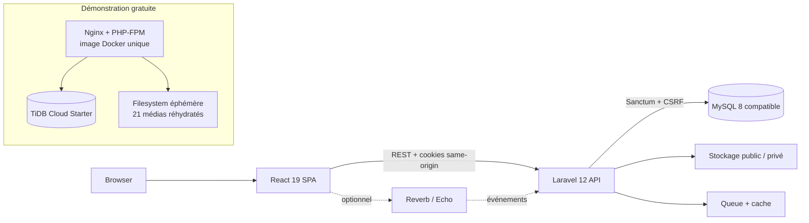

# YaZoo

YaZoo est une plateforme sociale et marketplace animalière full-stack destinée au marché marocain, développée avec React, Laravel et MySQL.


[](https://github.com/5eef/YaZoo/actions/workflows/ci.yml)
[](LICENSE)


## Problème résolu

YaZoo réunit dans une seule expérience une communauté autour des animaux, un fil social et une marketplace d'animaux, produits et services professionnels. Les utilisateurs peuvent découvrir des vétérinaires, échanger, réserver et suivre leurs demandes sans multiplier les plateformes.

La confiance est traitée comme une fonction du produit : publication modérée, vérification des professionnels, protection des coordonnées, signalements, avis et gouvernance des comptes sensibles.

## Mon rôle

Développé par Youssef BOUGHIOUL dans le cadre de son projet de formation / PFE OFPPT, avec contribution full-stack.

[GitHub @5eef](https://github.com/5eef) · [bough.youssef@gmail.com](mailto:bough.youssef@gmail.com)

## Fonctionnalités clés

- Authentification sécurisée, OAuth Google optionnel et gestion des profils.
- Feed social avec posts, commentaires, réactions, abonnements et stories.
- Marketplace pour animaux, produits, services animaliers et vétérinaires.
- Réservations, rendez-vous vétérinaires, historique, factures et évaluations.
- Modération, signalements, gouvernance admin et vérifications professionnelles.
- Favoris, messagerie, notifications temps réel optionnelles ou actualisation classique.
- Interface responsive, accessible et internationalisée en français, arabe et anglais.

## Architecture

Le dépôt conserve l'architecture complète pour le développement et une image plus légère pour la démonstration gratuite.



- Architecture complète : conteneurs React, Laravel, MySQL, Redis, worker, scheduler et Reverb séparés avec `docker-compose.yml`.
- Architecture showcase : `Dockerfile.demo` sert React et Laravel sur le même host ; sessions et cache utilisent SQL, la queue est synchrone et Reverb est désactivé.

## Stack

| Domaine | Technologies vérifiées |
| --- | --- |
| Frontend | React 19, Vite 8, Tailwind CSS 3, Axios, React Router 8 |
| Backend | PHP 8.4 dans l'image runtime, Laravel 12, Sanctum 4, Socialite 5 |
| Data | MySQL 8 compatible, TiDB Starter pour le showcase, SQLite pour les tests rapides |
| Infra | Docker, GitHub Actions, Nginx, PHP-FPM |
| Qualité | PHPUnit 11, Vitest 4, Playwright, ESLint 10, SonarCloud |

## Tests et sécurité

Résultats obtenus sur cette révision :

| Contrôle | Résultat |
| --- | --- |
| Backend PHPUnit | 394 tests réussis (2 142 assertions) |
| Frontend Vitest | 131 tests réussis |
| Playwright E2E | 97 scénarios réussis |
| Qualité frontend | ESLint, TypeScript, i18n et audit Tailwind réussis |
| Dépendances | Composer sans advisory ; audit npm production sans vulnérabilité |
| Conteneurs | Compose valide ; images release et `Dockerfile.demo` construites |

L'application combine Sanctum, cookies HttpOnly, CSRF, rate limiting, MFA administrateur, politiques d'autorisation, modération, CORS restreint et en-têtes de sécurité. Les secrets restent hors Git et les contrôles de démarrage échouent explicitement sur une cible de base ou une configuration dangereuse.

## Demo

**Demo publique : en préparation.** Aucune URL n'est publiée tant que l'environnement gratuit n'a pas été créé et vérifié.

- Mode : `showcase`
- Données : entièrement fictives
- Hébergement prévu : free-tier, non destiné à la production commerciale
- Aperçu marketplace : [capture Playwright réelle](docs/screenshots/yazoo-marketplace.png)

## Installation locale

### Docker Compose — architecture complète

Prérequis : Git, Docker Desktop et Docker Compose.

```bash
git clone https://github.com/5eef/YaZoo.git
cd YaZoo
cp .env.example .env
```

Renseigner dans le `.env` local une `APP_KEY` Laravel et des mots de passe de développement forts pour MySQL et Redis, puis :

```bash
docker compose up -d --build
docker compose exec app php artisan migrate --seed --force
```

Frontend : `http://localhost:4173` · API : `http://localhost:8000/api`. Le MySQL Docker utilise le port hôte `3308` pour rester distinct de MySQL Server (`3306`) et XAMPP MariaDB (`3307`).

### Installation manuelle

```bash
cd backend
composer install
cp .env.example .env
php artisan key:generate
php artisan migrate --seed
php artisan serve
```

Dans un second terminal :

```bash
cd frontend
npm ci
npm run dev
```

## Documentation

| Sujet | Document |
| --- | --- |
| Architecture et exploitation | [Plan de montée en charge](docs/production-scaling-plan.md) |
| Sécurité | [Partage et configuration sécurisés](docs/SECURITY_SHARING.md) |
| Accessibilité | [Référentiel d'accessibilité](docs/ACCESSIBILITY.md) |
| Vie privée / CNDP | [Préparation CNDP](docs/CNDP_PRIVACY_READINESS.md) |
| Conformité animale / ONSSA | [Notes ONSSA](docs/ONSSA_COMPLIANCE_NOTES.md) |
| Paiements | [Architecture des paiements](docs/PAYMENTS_ARCHITECTURE.md) |
| Déploiement showcase | [Déploiement gratuit Koyeb + TiDB](docs/DEMO_DEPLOYMENT_FREE.md) |
| Historique cloud | [Archives Azure décommissionnées](docs/archive/azure/README.md) |

## Licence et auteur

Distribué sous licence [MIT](LICENSE).

Youssef BOUGHIOUL · [GitHub @5eef](https://github.com/5eef) · [bough.youssef@gmail.com](mailto:bough.youssef@gmail.com)
