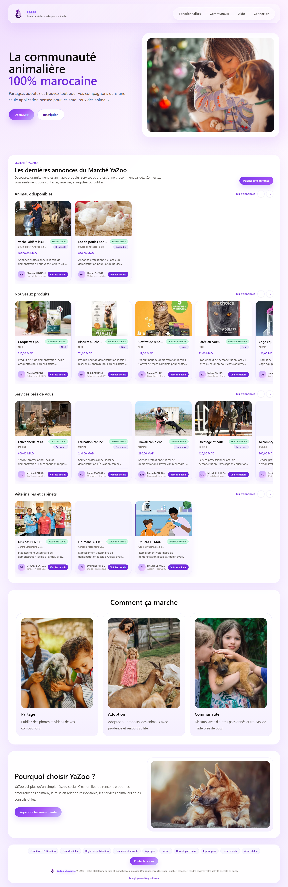
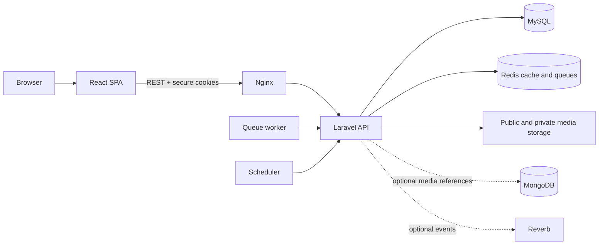
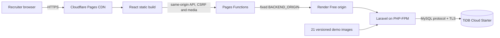
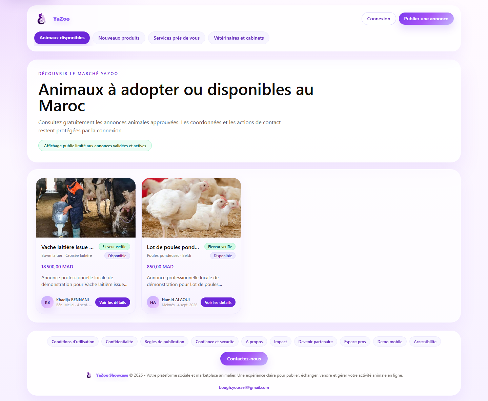

# YaZoo

## Social & Marketplace Platform for the Animal Ecosystem

YaZoo is a full-stack platform that brings animal-focused communities, social publishing, trusted marketplace listings, veterinary services, and reservations into one responsive product. It is presented here as an engineering case study for recruiters and technical reviewers.


[](https://github.com/5eef/YaZoo/actions/workflows/ci.yml)
[](LICENSE)
[](https://yazoo-showcase.onrender.com/)



## Live portfolio demo

**[Open the YaZoo public showcase](https://yazoo-showcase.onrender.com/)**

The hosted application is a real React and Laravel deployment backed by TiDB Cloud over TLS. Public marketplace pages can be explored without an account. A controlled reviewer account is also available:

```text
Email: client.fes@yazoo.test
Password: provided privately to reviewers; never stored in this repository
```

Because this showcase runs on Render's Free plan, the first visit after inactivity can take about one minute while the service wakes up. Refresh once when the loading page disappears.

### Three-minute reviewer tour

1. Browse the public animal, product, service, and veterinarian catalogs.
2. Sign in with the reviewer account and scroll through the image-rich social feed and profile.
3. Open marketplace details, favorites, communities, reservations, messages, and notifications.
4. Resize the browser or use mobile emulation to review the responsive interface.
5. Administrative moderation, statistics, professional verification, and MFA flows are available in a supervised review.

Operational probes: [`/health/live`](https://yazoo-showcase.onrender.com/health/live) · [`/health/ready`](https://yazoo-showcase.onrender.com/health/ready)

## Project overview

Animal owners, professionals, and local communities often have to move between unrelated social networks, classified-ad sites, messaging tools, and appointment systems. YaZoo explores a cohesive alternative: users can discover relevant content and professionals, communicate, reserve services or listings, and build trust through moderation, reviews, and professional verification.

The application includes community publishing, posts and stories, animal/product/service/veterinarian marketplaces, reservations, veterinary appointments, messaging, notifications, profiles, favorites, reviews, reports, moderation, and administrative workflows. External integrations remain configuration-driven so the same codebase can support a complete local topology and a deliberately constrained public showcase.

## My role

YaZoo demonstrates the work of **Youssef Boughioul, Junior Full-Stack Developer**. Responsibilities represented in this repository include:

- React interface architecture, responsive layouts, accessibility, and internationalization;
- Laravel REST API design, validation, authorization, and business workflows;
- relational data modeling, migrations, seeders, and concurrency-sensitive operations;
- Sanctum authentication, CSRF protection, administrative MFA, and security controls;
- automated backend, frontend, browser, accessibility, and deployment tests;
- Docker, Nginx, GitHub Actions, release checks, and showcase deployment design.

## Features

### Social and communities

- Feed posts, comments, reactions, follows, and time-limited stories.
- Public and private communities with membership requests and role-aware management.
- Global search and unread state for messages and notifications.

### Marketplace

- Dedicated animal, product, service, and veterinarian catalogs.
- Public preview and listing detail routes for unauthenticated discovery.
- Contact-visibility controls, favorites, listing moderation, and animal compliance fields.

### Veterinarians and reservations

- Veterinarian profiles, availability slots, appointments, and appointment reviews.
- Unified animal, product, and service reservation workflows.
- Status transitions, order history, invoices, delivery state, and configured payment strategies.

### Messaging, reviews, and trust

- Direct conversations, notifications, favorites, reports, and post-transaction reviews.
- Professional verification workflows with private document handling.
- Moderation actions, account suspension, content review, and administrative dashboards.

### Authentication and security

- Email/password and optional Google OAuth flows, with phone OTP providers behind configuration.
- Secure cookie-based Sanctum authentication and explicit CSRF checks for cookie mutations.
- Rate limits, policies, validation, administrator MFA, recovery codes, and audit-oriented activity logs.

### Internationalization and accessibility

- French, Arabic, and English interface content with RTL-aware layouts.
- Keyboard-conscious dialogs and navigation, semantic UI states, and automated Axe coverage.
- Responsive behavior tested across mobile, tablet, and desktop viewports.

## Technology stack

| Area | Technologies |
| --- | --- |
| Frontend | React 19, Vite 8, JavaScript, Tailwind CSS 3, React Router 8, Axios, i18n |
| Backend | PHP 8.4 runtime, Laravel 12, REST API, Sanctum, Socialite |
| Data | MySQL-compatible relational model, TiDB Cloud for the showcase, SQLite for fast automated tests |
| Infrastructure | Docker, Docker Compose, Nginx, PHP-FPM, Docker Hub, Render, GitHub Actions |
| Quality | PHPUnit, Vitest, Playwright, Axe, ESLint, TypeScript checks, Pint, Composer/npm audits, SonarCloud integration |

## Architecture

### Full project architecture



Docker Compose keeps the frontend, API, Nginx, MySQL, Redis, queue worker, scheduler, and optional realtime service independently operable for local or fuller deployments.

### Public showcase architecture



Cloudflare serves the React shell independently of the sleeping backend. Pages Functions keep browser traffic same-origin while proxying only the API, Sanctum, storage, and broadcasting routes to a fixed Render origin. Database-backed cache and sessions remove the Redis requirement; synchronous queues remove the worker requirement; versioned media can be restored after the ephemeral container filesystem is reset.

The React interface is delivered instantly from Cloudflare's CDN. The free Laravel demo API may take up to about one minute to wake after inactivity.

## Security design

- Laravel form-request validation and model policies protect domain operations.
- Sanctum tokens stay in HttpOnly cookies; cookie-authenticated mutations require an allowed origin and matching CSRF token.
- HTTPS enforcement, secure encrypted session cookies, restricted CORS origins, and explicit proxy trust are environment controlled.
- Authentication and sensitive operations are rate limited; protected administrator routes require role checks and MFA state.
- Upload validation, private verification documents, ownership checks, moderation, and cleanup workflows reduce media risk.
- Expected-database guards fail closed before production migrations or showcase bootstrap.
- Secrets are provided only at runtime and are excluded from tracked environment examples and deployment logs.

No system is described as perfectly secure. The repository documents controls that are implemented and covered by automated tests.

## Testing and verified results

The following results were reproduced on the current showcase candidate on 4 September 2026:

| Check | Verified result |
| --- | --- |
| Backend PHPUnit | **394/394 passed**, 2,142 assertions |
| Frontend Vitest | **131/131 passed** |
| Browser and accessibility | **97/97 Playwright scenarios passed**, including Axe checks |
| Responsive coverage | Mobile, tablet, desktop, LTR/RTL, light/dark scenarios passed |
| Static quality | ESLint, TypeScript, i18n completeness, Tailwind audit, legal placeholder audit, and Pint passed |
| Dependency audits | Composer and npm reported no known advisories |
| Frontend build | Vite production build passed |
| Showcase container | `Dockerfile.demo` built; two bootstraps, health endpoints, deep links, register/login/CSRF/logout, and 21 media files passed |
| Split frontend candidate | **143/143 Vitest** and **98/98 Playwright** scenarios passed; Cloudflare static, public API, deep-link, and 21/21 media checks passed |

Reproduce the main checks:

```powershell
cd backend
composer install
php artisan optimize:clear
php artisan test
vendor\bin\pint --test
composer audit

cd ..\frontend
npm ci
npm run lint
npm run typecheck
npm run audit:i18n
npm run test -- --run
npm run test:coverage -- --run
npm run build
npm run audit:tailwind
npm run test:e2e
npm audit
```

The host PHP installation must provide the extensions required by `composer.json`. The Docker runtime installs the required PHP extensions explicitly and is the reference environment for the showcase smoke test.

## API overview

The versioned application surface is organized around a Laravel REST API:

| Domain | Representative capabilities |
| --- | --- |
| Auth | Registration, login, logout, current user, verification, recovery, optional OAuth/OTP |
| Users and social | Profiles, follows, feed posts, comments, reactions, stories, communities |
| Marketplace | Animals, products, services, veterinarians, public previews, favorites |
| Reservations | Unified reservations, delivery state, invoices, payments, reviews |
| Veterinary care | Availability, appointments, appointment status, reviews |
| Communication | Conversations, messages, notifications, contact, reports |
| Admin | Users, moderation, marketplace review, professional verification, statistics, exports |

Routes are defined in [`backend/routes/api.php`](backend/routes/api.php). The project does not currently publish an OpenAPI document, so this summary intentionally avoids presenting generated API documentation that does not exist.

## Local development

### Prerequisites

- Git
- PHP 8.2+ with Composer and the extensions required by `backend/composer.json`
- Node.js 22.22+ and npm
- MySQL-compatible database, or Docker Desktop with Docker Compose

### Clone and configure

```bash
git clone https://github.com/5eef/YaZoo.git
cd YaZoo
cp .env.example .env
cp backend/.env.example backend/.env
cp frontend/.env.example frontend/.env
```

Use only local development credentials in these untracked files. Generate a Laravel `APP_KEY`; do not copy a deployed key or any cloud secret.

### Manual backend and frontend

```bash
cd backend
composer install
php artisan key:generate
php artisan migrate --seed
php artisan serve
```

In another terminal:

```bash
cd frontend
npm ci
npm run dev
```

The default development frontend proxies API, Sanctum, storage, and broadcasting requests to the Laravel server.

### Docker Compose

```bash
cp .env.example .env
docker compose up -d --build
docker compose exec app php artisan migrate --seed --force
```

The default local mapping uses frontend port `4173`, API port `8000`, and Docker MySQL port `3308`. This keeps Docker MySQL separate from the workstation MySQL server on `3306` and XAMPP MariaDB on `3307`.

## Docker images

- [`backend/Dockerfile`](backend/Dockerfile) builds the Laravel API runtime.
- [`frontend/Dockerfile`](frontend/Dockerfile) builds the standalone frontend runtime.
- [`Dockerfile.demo`](Dockerfile.demo) assembles the React build, Laravel, PHP-FPM, Nginx, and versioned demo media into one lightweight recruiter-showcase service on port `8080`.
- [`Dockerfile.api-demo`](Dockerfile.api-demo) builds the backend-only Laravel showcase candidate used after the Cloudflare frontend cutover.
- [`docker-compose.yml`](docker-compose.yml) runs the fuller multi-service local topology.

## Public showcase deployment

The verified Render monolith remains the published rollback while the Cloudflare split candidate completes its authentication cutover. The candidate frontend is deployed at `https://yazoo-showcase.pages.dev`; it must not replace the portfolio link until register/login/current-user/logout all pass through the same-origin proxy.

Target split topology:

```text
Cloudflare Pages static React
        -> Cloudflare Pages Functions (same-origin proxy)
        -> Render Free Laravel API
        -> TiDB Cloud Starter over TLS
```

The Pages project uses `frontend` as its root, `npm run build` as its build command, and `dist` as its output directory. Its only server-side origin binding is `BACKEND_ORIGIN=https://yazoo-showcase.onrender.com`; no Render URL or secret is compiled into the browser bundle.

The deployment target is intentionally small:

```text
Docker Hub immutable image
        -> Render Free Web Service
        -> TiDB Cloud Starter over TLS
```

The verified showcase is available at **[https://yazoo-showcase.onrender.com/](https://yazoo-showcase.onrender.com/)**. The exact zero-cost runbook is available in [`docs/DEMO_DEPLOYMENT_FREE.md`](docs/DEMO_DEPLOYMENT_FREE.md).

The deployed service uses the immutable Docker image `docker.io/5eef/yazoo-demo:beca3d278146` in Render's Frankfurt region. On 5 September 2026, both health probes reported `status: ok`, the TiDB readiness check passed, public routes returned HTTP 200, and real reviewer-account login, authenticated navigation, and logout were exercised against the public URL. A controlled restart also passed with no pending migrations, no repeated data bootstrap, all 21 versioned media files restored, and the production preflight successful.

The showcase intentionally disables integrations that require external paid or persistent infrastructure:

- CMI payment processing and SMS delivery;
- outbound email delivery (Laravel log transport is used);
- persistent visitor uploads;
- Reverb realtime delivery, queue workers, and the scheduler.

These capabilities remain represented in the full codebase; their absence from the free showcase is a deployment choice, not a claim that paid providers are active.

### Showcase limitations

- Render Free services can sleep after inactivity, so the first request can take about a minute.
- The container filesystem is ephemeral and can be replaced on sleep, restart, or deploy.
- Controlled demo data can be reset or reseeded; it must not be treated as user storage.
- Versioned showcase images are restored, but visitor uploads are disabled and do not persist.
- Paid-provider integrations and outbound email are intentionally disabled.
- The environment is a portfolio demonstration, not a commercial production service or SLA-backed system.

## Screenshots

| Home | Marketplace |
| --- | --- |
|  |  |

## Project structure

```text
YaZoo/
├── backend/              Laravel API, migrations, seeders, tests
├── frontend/             React application, unit and browser tests
├── infra/nginx/          Multi-service Nginx configuration
├── deploy/               Deployment and operational helpers
├── scripts/              CI, audit, smoke-test, and maintenance scripts
├── docs/                 Architecture, security, compliance, and operations
├── .github/workflows/    CI and release workflows
├── docker-compose.yml    Full local topology
└── Dockerfile.demo       Single-container public showcase
```

## CI/CD

GitHub Actions validates pull requests with Composer and npm audits, PHP tests and coverage, frontend static checks, Vitest coverage, the Vite build, Playwright/Axe scenarios, deployment guards, Docker Compose validation, container builds, secret scanning, SBOM generation, and container vulnerability scanning.

Deployment is not presented as automatic: Docker Hub publication and Render promotion remain explicit, gated release steps after all checks pass.

## Roadmap

- Add richer public observability while preserving privacy-safe telemetry.
- Evaluate persistent object storage before enabling visitor uploads in a hosted environment.
- Publish generated OpenAPI documentation for selected public API domains.

## License and contact

YaZoo is distributed under the [MIT License](LICENSE).

**Youssef Boughioul**<br>
Junior Full-Stack Developer<br>
Morocco

[GitHub @5eef](https://github.com/5eef) · [Email](mailto:bough.youssef@gmail.com)

Built in Morocco.
